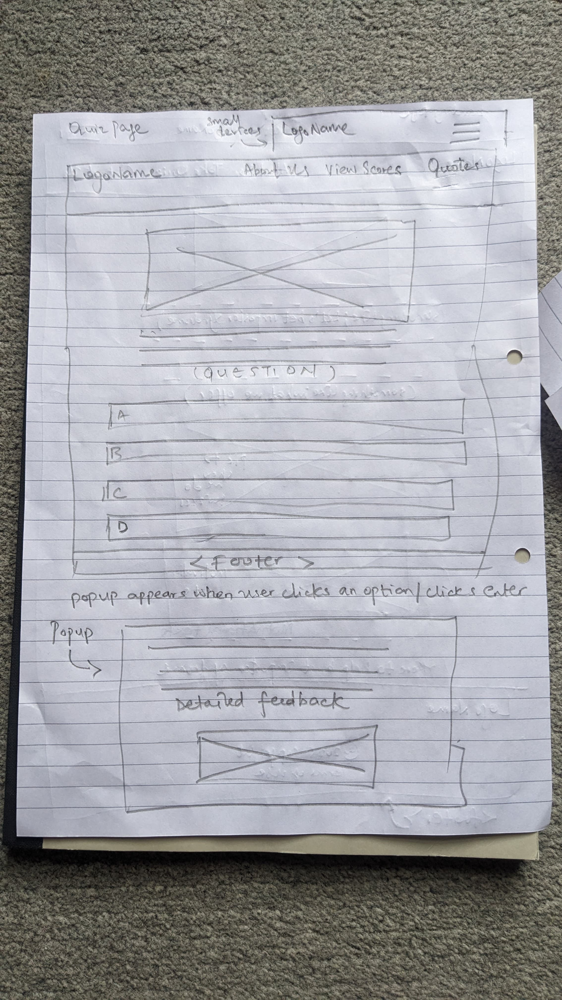

# Summit Nexus (Team 7)'s Debug your doubts

## Project Goal

This project aims to support software developers experiencing impostor syndrome by providing a safe and encouraging space to explore common professional scenarios. Through an interactive quiz, developers can learn to identify helpful and unhelpful thought patterns and reactions, ultimately fostering greater self-compassion and confidence.

## How It Works

The application presents users with various situations that software developers might encounter in their daily work. For each situation, users are given multiple response options.

* **Choosing the Best Answer:** Selecting the answer marked as the "correct" one earns the user score points and reinforces positive and constructive reactions.
* **Learning from Other Choices:** If a user selects an answer that isn't the best approach, they will receive:
    * **Reasoning:** A clear explanation of why their chosen answer might not be the most effective or helpful in that situation.
    * **Motivational Boost:** A motivational fact or a witty quote accompanied by a relevant image to offer encouragement and lighten the mood. Think of it as a gentle reminder to stay positive!
* **Scoring:** The application tracks the user's score, rewarding them for recognizing and selecting constructive responses.

## Design: Colour scheme, wireframes and typography

### Typography used
- Montserrat
- Poppins

## Wireframes

## Key Features

* **Interactive Quiz:** Engaging scenarios designed to resonate with the experiences of software developers facing impostor syndrome.
* **Immediate Feedback:** Clear explanations for both correct and incorrect answers, promoting learning and self-reflection.
* **Motivational Content:** Uplifting quotes and images displayed for incorrect answers to encourage persistence and a positive mindset.
* **Scoring System:** Tracks progress and rewards users for identifying helpful responses.
* **Multi-Page Application:**
    * **Landing Page:** Welcomes users and introduces the purpose of the quiz.
    * **Quiz Page:** Presents the interactive quiz questions and answer choices.
    * **About Page:** Introduces the team members behind this project.
    * **Scoreboard:** Displays the user's final score (and potentially a way to track high scores in future iterations).
* **Client-Side Technologies:** Built using fundamental web technologies: HTML for structure, CSS for styling, and JavaScript for interactivity.
* **Planned Testing:** The project includes plans for thorough testing to ensure a smooth and reliable user experience.

## User Stories

* As a software developer experiencing impostor syndrome, I want to easily understand the purpose of this application on the landing page so I know if it can help me.
* As a user, I want to be presented with realistic scenarios that I might encounter in my software development career.
* As a user, when I answer a quiz question correctly, I want to receive positive feedback and have my score updated so I feel encouraged.
* As a user, when I answer a quiz question incorrectly, I want to understand why my answer wasn't the best option through a clear explanation.
* As a user who answered incorrectly, I want to see a motivational quote or fact with a funny image to help me feel better and not get discouraged.
* As a user, I want to be able to see my final score at the end of the quiz so I can track my progress and understanding.
* As a user, I want to learn more about the team that created this application on an "About" page so I can connect with them or understand their motivations.
* As a user, I want the application to be easy to navigate between the different pages (landing, quiz, about, scoreboard).
* As a developer of this application, I want to ensure the quiz logic and scoring are accurate through automated tests.
* As a user, I want the application to be visually appealing and easy to read so that I can focus on the content.

## Technologies Used

* HTML
* CSS
* JavaScript

### Other technologies used
* Coolors.so
* canvas.com
* W3C Validators
* Slack
* Google Fonts
* Font Awesome Icons

## Credits and content
- GenAI was used to generate certain images for the quiz.
- Canva was used to make the project logo and team logo.
- Font Awesome's Icons were used.
- W3C Validator to perform HTML and CSS tests.
- Coolors.so to make a colour palette for the website.
- GitHub was used for version control, team collaboration and effective project management.
- GitHub Pages/ Render was used to deploy the application.

## Project Structure

The application is organized into the following pages:

1.  **`index.html` (Landing Page):**
    * Provides an introduction to the quiz and its purpose.
    * Includes a call to action to start the quiz.
2.  **`quiz.html` (Quiz Page):**
    * Displays the quiz questions and answer choices.
    * Handles user interactions, feedback display, and scoring.
3.  **`about.html` (About Page):**
    * Introduces the team members who created this project.
    * May include brief bios or roles.
4.  **`scoreboard.html` (Scoreboard):**
    * Displays the user's final score after completing the quiz.
    * (Future feature: potentially track and display high scores).
5.  **`css/` (CSS Styles):**
    * Contains the stylesheets (`style.css` or similar) for the application's visual presentation.
6.  **`js/` (JavaScript Scripts):**
    * Contains the JavaScript files (`script.js` or similar) for handling quiz logic, feedback, scoring, and page interactions.
    * May include separate files for different functionalities.
7.  **`assets/img/` (Images):**
    * Stores images used throughout the application, including motivational images for incorrect answers.

## Testing

We plan to implement manual tests to ensure the functionality and reliability of the quiz logic, scoring system, and user interface interactions. This will help us identify and fix any potential issues before deployment.

### Development Testing

During development, we use Jest to ensure the functionality and reliability of the application's JavaScript logic.  This includes unit and integration tests for:

* Quiz question and answer handling
* Scoring calculations
* Feedback display
* Navigation logic

### Deployment Testing

Since this application is deployed on Github Pages, which serves static files, we perform manual testing to verify the user experience and functionality in a browser environment. The following tables outline the manual testing procedures for each page:

#### Landing Page (`index.html`)

| TEST ACTION                                                                    | EXPECTATION                                                                                               | RESULT    |
| :----------------------------------------------------------------------------- | :-------------------------------------------------------------------------------------------------------- | :-------- |
| User opens the landing page URL                                                | The landing page is displayed with a title, introduction, and a call to action.                            | SUCCESS  |
| User clicks the "Uncover your true potential" button                                            | The user is redirected to the quiz page (`quiz.html`).                                                    | SUCCESS   |
| Once the user has scrolled all the way down they see a "Lean More" button and they click on it | The learn-more.html page opens | SUCCESS |
| User scrolls down the page | More content appears block by block | SUCCESS |
| User views the page on different screen sizes (desktop, mobile)               | The layout is responsive and content is displayed correctly.                                               | SUCCESS   |

#### TEST STATUS: SUCCESS

#### Quiz Page (`quiz.html`)

| TEST ACTION                                                                    | EXPECTATION                                                                                                                                                                                          | RESULT    |
| :----------------------------------------------------------------------------- | :-------------------------------------------------------------------------------------------------------------------------------------------------------------------------------------------------- | :-------- |
| User clicks on the Quiz link in the navigation bar | A prompt for entering a username appears | SUCCESS |
| User provides no name in the prompt that opens upon opening the Quiz page | A message appears informing the user that they need to enter a username | SUCCESS: For the time being an alert is used to display the message. Should be replaced with a modal in the future |
| Upon providing a username in the prompt                                                   | The quiz page is displayed with the first question, answer options, and a motivationl statement accompanied by images above the quiz.                                                                                                            | SUCCESS   |
| User selects an answer                                                  | The aswer option gets highlighted, so the user can see the option they picked | SUCCESS   |
| User clicks on 'Submit Aswer' and the answer is  incorrect | The correct answer is highlighted in green and the one they picked is highlighted in red. The user receives feedback explaining why the answer is incorrect and the 'next question' button appears.| SUCCESS |
| User clicks on 'Submit Anser' and the anser is correct | Their option is highlighted in green and all the other options dissapear from screen. The user receives feedback explaining why the answer is correct and the 'next question' button appears.| SUCCESS |
| User completes the quiz                                                        | The user can see a carousel that lets them review their answers. Also, two buttons appear 'Restart Game' and 'View High Scores' | SUCCESS   |
| User clicks on the 'Restart Game' buttoon once the game is finished | The game is reset to the first question | FAILED. The prompt for entering a username appears instead |
| User clocks on the 'View High Scores' button and the score-board page opens | SUCCESS |
| User navigates through multiple questions.                                         | The questions are displayed in the correct order, and the quiz functions as expected.                                                                                                                    | SUCCESS  |
| User refreshes the page mid-quiz.                                               | The quiz restarts from the beginning (or the user's progress is saved - if implemented).                                                                                                      | FAILED  |
| User opens the quiz on a mobile device | The layout of the quiz is responsive | SUCCESS |

#### TEST STATUS: PARTIAL SUCCESS

#### About Page (`about.html`)

| TEST ACTION                                                                    | EXPECTATION                                                                        | RESULT    |
| :----------------------------------------------------------------------------- | :--------------------------------------------------------------------------------- | :-------- |
| User opens the about page URL                                                  | The about page is displayed with information about the team members.                | SUCCESS   |
| User views the team member information                                         |  The names, and any other displayed information about the team members are accurate.  | SUCCESS   |
| User checks for broken links/images.                                            | All links are functional, and all images are displayed correctly.           | SUCCESS   |
| User views the page on different screen sizes (desktop, mobile)                | The layout is responsive, and content is displayed correctly.                         | SUCCESS   |

#### TEST STATUS: SUCCESS

#### Scoreboard Page (`scoreboard.html`)

| TEST ACTION                                                                    | EXPECTATION                                                                                    | RESULT    |
| :----------------------------------------------------------------------------- | :--------------------------------------------------------------------------------------------- | :-------- |
| User opens the scoreboard page URL                                             | The scoreboard page is displayed.                                                               | to be added   |
| User views their score after completing the quiz.                                 | The user's score from the completed quiz is displayed correctly.                                 | to be added   |
| User views the page on different screen sizes (desktop, mobile)                | The layout is responsive, and content is displayed correctly.                                    | to be added   |
| User navigates to the scoreboard without completing the quiz.                  | The scoreboard displays an appropriate message (e.g., "Complete the quiz to see your score").    | to be added   |
| User checks the layout and visual presentation of the scoreboard.            | The scoreboard is visually appealing and easy to read.                               | to be added   |

#### TEST STATUS: SUCCESS

## Contributing

(Optional: If you plan to open-source and accept contributions)

We welcome contributions to this project! If you have ideas for new scenarios, motivational content, or improvements to the code, please feel free to submit a pull request or open an issue.

## License

This project is a public project. GPL terms apply.

## Team Members (Mention on the About Page)

* [Alina Teodora Brinzac](https://github.com/TeodoraAlina)
* [Dimitri Edel](https://github.com/dimitri-edel)
* [Uchechukwu Christian](https://github.com/Uche05)
* [Rehanon Mackenzie](https://github.com/Rehanon-Mackenzie)

## Future Enhancements (Optional)

* More quiz questions and scenarios.
* User accounts to save progress.
* Categorization of questions by specific areas of impostor syndrome.
* A more detailed results page with personalized insights.
* Integration with social media to share scores (optional and with careful consideration of the sensitive nature of the topic).
* More diverse and inclusive scenarios.

We hope "Debug your doubts" provides valuable support and encouragement to software developers on their journey to recognizing their skills and overcoming impostor syndrome!
